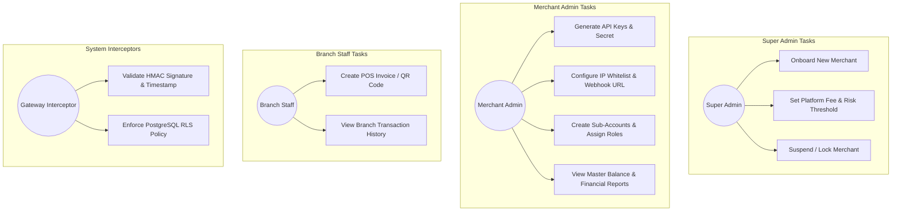
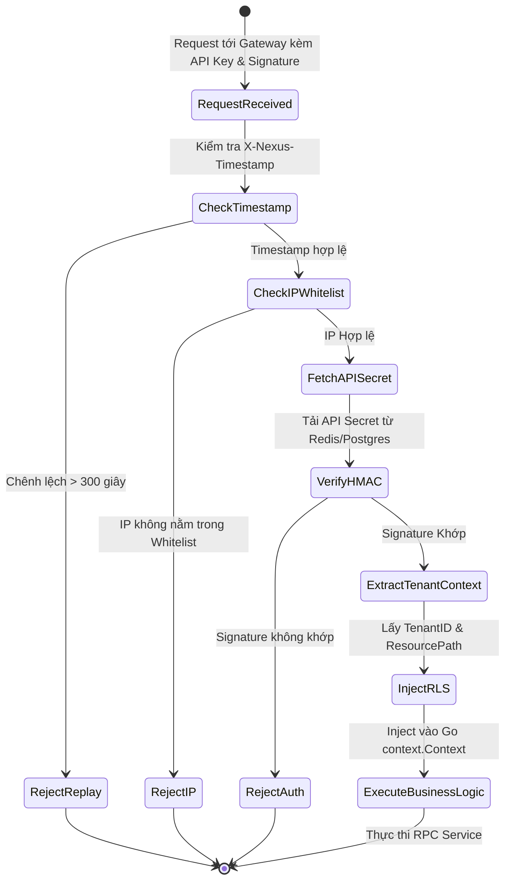
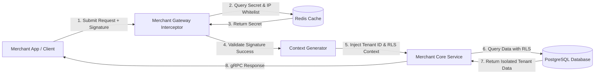
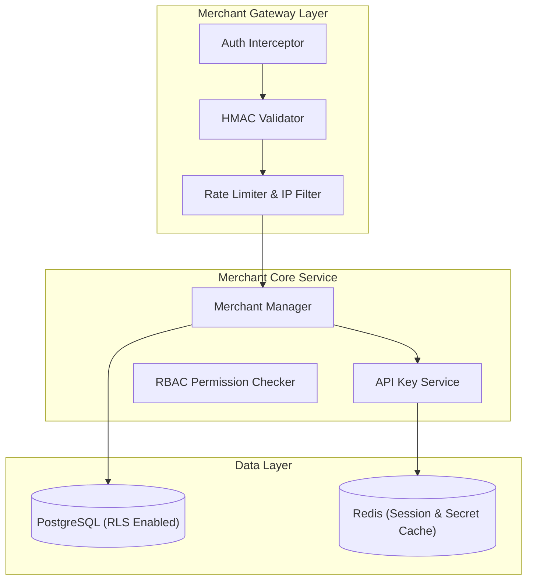
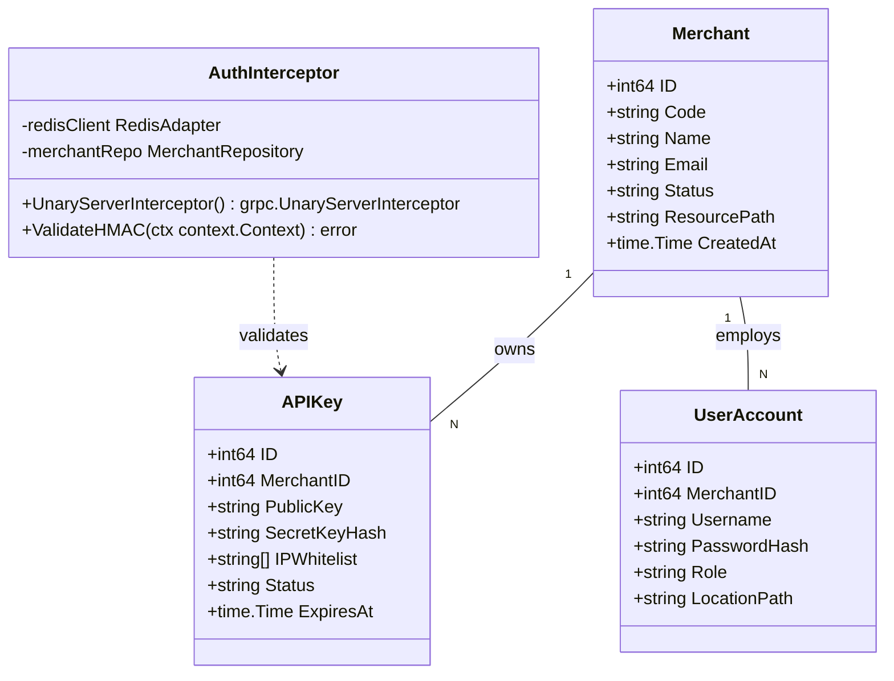
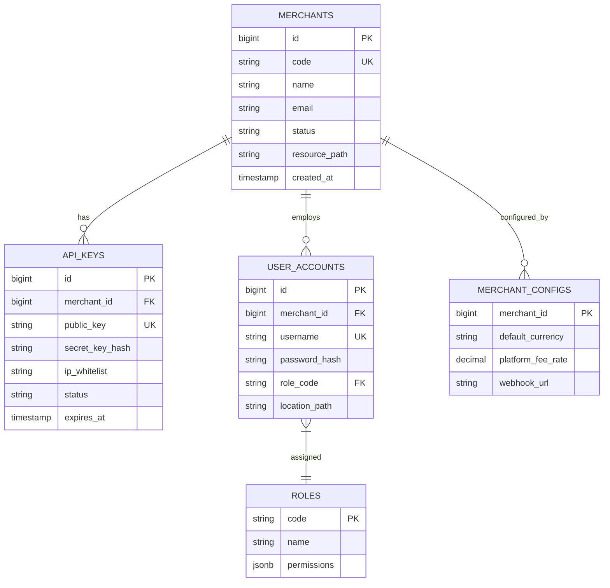

# 📄 Nghiệp vụ 1: Onboarding Merchant, Cấp Phát API Key & Phân Quyền Đa Thuê Bao (Multi-Tenant & RBAC)

Tài liệu này tả chi tiết toàn bộ quy trình nghiệp vụ, sơ đồ thiết kế Use Case, Activity, DFD, Component, Class/Struct và ERD cho phân hệ **Quản lý Merchant, Cấp phát khóa bảo mật API Key/Secret và Phân quyền truy cập theo cấu trúc tổ chức/chi nhánh (Multi-Tenant Location-Restricted RBAC)**.

---

## 📑 1. Quy Trình Nghiệp Vụ Chi Tiết (Business Workflow)

1. **Merchant Onboarding (Đăng ký Doanh nghiệp)**:
   - Super Admin tiếp nhận thông tin đăng ký của doanh nghiệp (Tên công ty, Email đại diện, Giấy phép kinh doanh, KYC).
   - Hệ thống khởi tạo một **Tenant ID** (Merchant ID) độc nhất và gán cấu hình mặc định (Loại tiền tệ mặc định, Phí giao dịch mặc định).
2. **Cấp phát & Quản lý Khóa API Key/Secret**:
   - Merchant Admin đăng nhập vào Dashboard và yêu cầu sinh cặp khóa API:
     - `API_KEY_PUBLIC`: Dùng cho các tích hợp phía Client Web/Mobile (Public ID).
     - `API_SECRET_PRIVATE`: Dùng cho Server-to-Server HMAC SHA256 signing (Chỉ hiển thị 1 lần duy nhất khi tạo).
   - Merchant cấu hình danh sách **IP Whitelist** (Chỉ cho phép các IP server này gọi API Rút tiền).
3. **Phân quyền Chi nhánh & Nhân sự (Location-Restricted RBAC)**:
   - Merchant tạo các tài khoản nhân viên (Sub-Accounts / Branch Staff) và phân quyền:
     - **Role Merchant Admin**: Toàn quyền quản lý, rút tiền, đổi Secret Key, xem báo cáo tổng.
     - **Role Branch Manager / POS Staff**: Chỉ có quyền tạo Hóa đơn nạp tiền, xem lịch sử giao dịch tại Chi nhánh/Cửa hàng được phân công (`resource_path = /org1/branchA/`). KHÔNG có quyền rút tiền hay đổi Secret Key.
4. **Cơ chế Xác thực Request (API Authentication Interceptor)**:
   - Mọi request gửi lên `merchant-gateway` phải chứa Header:
     - `X-Nexus-API-Key`: Key công khai.
     - `X-Nexus-Signature`: Chữ ký HMAC-SHA256(`body` + `timestamp`, `API_SECRET`).
     - `X-Nexus-Timestamp`: Thời gian tạo request (Chống Replay Attack, chênh lệch tối đa 300s).

---

## 🎯 2. Sơ Đồ Use Case (Use Case Diagram)

---

## 🔄 3. Sơ Đồ Hoạt Động (Activity Diagram)

---

## 🌊 4. Sơ Đồ Luồng Dữ Liệu (Data Flow Diagram - DFD Level 1)

---

## 🧩 5. Sơ Đồ Thành Phần (Component Diagram)

---

## 📐 6. Sơ Đồ Lớp / Struct Go (Class / Struct Diagram)

---

## 🗄️ 7. Sơ Đồ Thực Thể Liên Kết (ERD - Entity Relationship Diagram)

