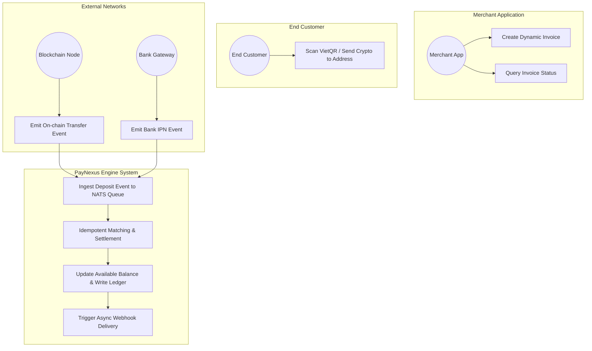
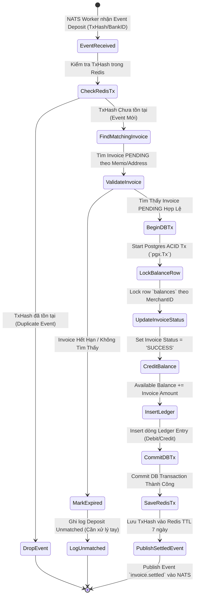
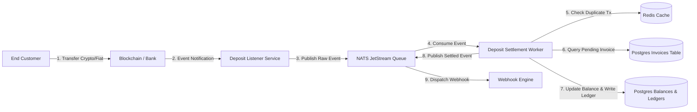
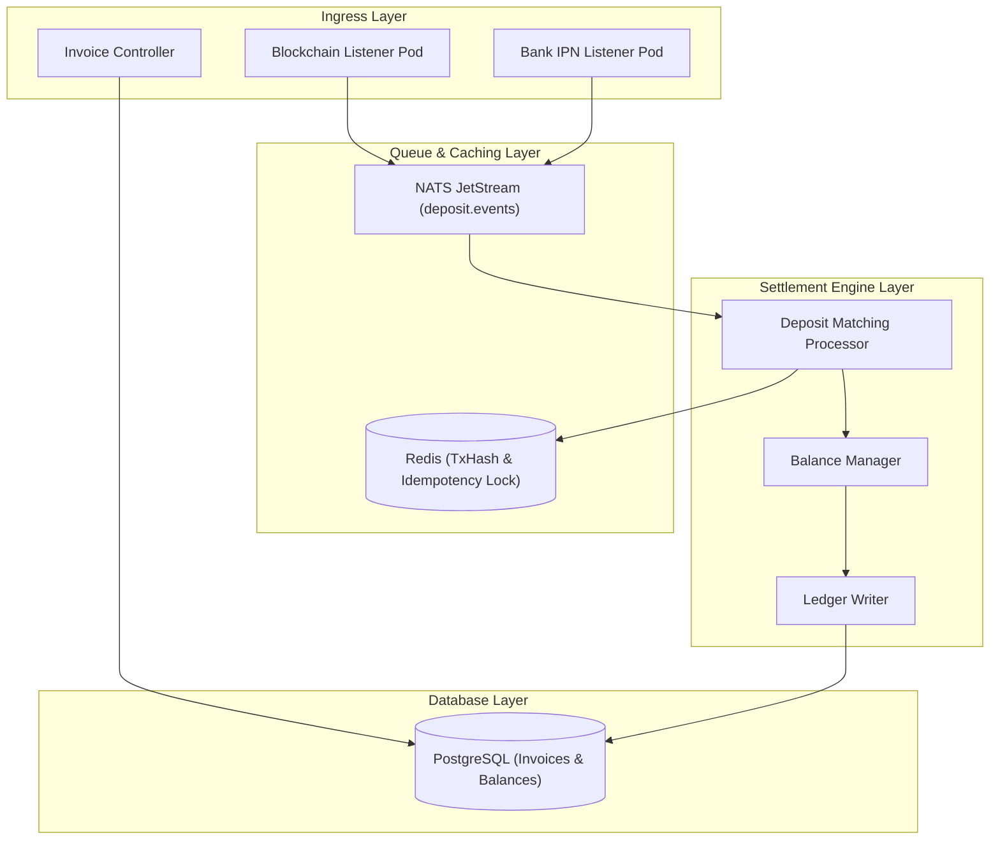
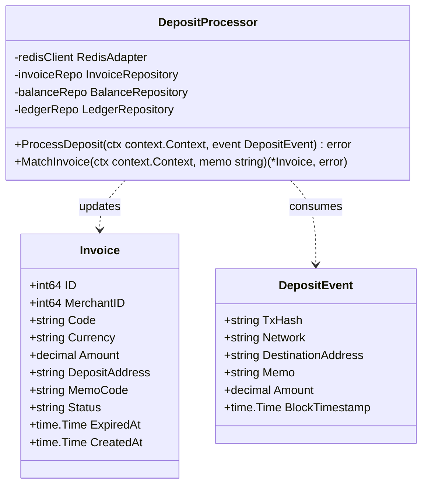
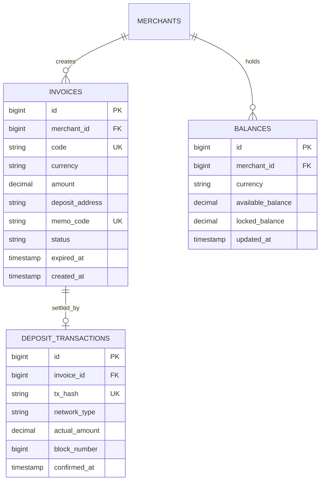

# 📄 Nghiệp vụ 2: Cổng Nạp Tiền & Xử Lý Hóa Đơn Tự Động (Deposit & Dynamic Invoice Gateway)

Tài liệu này mô tả chi tiết quy trình nghiệp vụ, sơ đồ Use Case, Activity, DFD, Component, Class/Struct và ERD cho phân hệ **Tạo Hóa đơn (Invoice Generation), Cấp phát địa chỉ ví/QR code linh hoạt và Xử lý Tiền vào (Deposit Ingestion) bất đồng bộ chống nạp trùng**.

---

## 📑 1. Quy Trình Nghiệp Vụ Chi Tiết (Business Workflow)

1. **Khởi tạo Hóa đơn Nạp tiền (Create Invoice Request)**:
   - Merchant App gọi gRPC/REST API `CreateInvoice(Amount, Currency, OrderReference)` kèm `Idempotency-Key` trên Header.
   - `payment-engine` kiểm tra `Idempotency-Key` trong Redis. Nếu key đã tồn tại ➔ Trả về kết quả Hóa đơn đã sinh trước đó (Ngăn chặn tạo hóa đơn trùng).
   - Nếu key chưa tồn tại ➔ Khởi tạo Hóa đơn ở trạng thái `PENDING` kèm thời gian hết hạn (`ExpiredAt` = 15-30 phút).
2. **Gán Phương thức Thanh toán (Address Pool / Dynamic QR Allocation)**:
   - **Với Fiat (VND)**: Hệ thống sinh mã VietQR động chứa mã `Memo Code` độc nhất (VD: `NEXUS-98123`).
   - **Với Crypto (USDT/USDC)**: 
     - *Phương án A*: Cấp phát 1 địa chỉ Ví tạm thời từ `Address Pool` sẵn có.
     - *Phương án B*: Dùng 1 địa chỉ Ví duy nhất kèm `Memo/Tag` định danh cho từng hóa đơn.
3. **Lắng nghe Sự kiện Tiền vào (On-chain / Banking Event Ingestion)**:
   - **Blockchain Listener Pod**: Lắng nghe sự kiện Transfer token trên BSC/Tron/Solana ➔ Publish Event `deposit.crypto.detected` vào **NATS JetStream**.
   - **Banking Webhook Pod**: Lắng nghe IPN từ cổng Ngân hàng ➔ Publish Event `deposit.fiat.detected` vào **NATS JetStream**.
4. **Xử lý Khớp Hóa đơn & Cộng Số dư (Idempotent Matching & Settlement)**:
   - Worker nhận Event từ NATS Queue.
   - **Idempotency Verification**: Kiểm tra `TxHash` (Crypto) hoặc `BankTransactionID` (Fiat) trong Redis. Nếu đã xử lý ➔ Drop Event.
   - **Matching Logic**: Tìm Hóa đơn `PENDING` có đúng `Memo Code` / `Deposit Address` và `Amount` thỏa mãn chênh lệch cho phép.
   - **Atomic Transaction Settlement**:
     - Mở PostgreSQL ACID Transaction (`pgx.Tx`).
     - Chuyển trạng thái Hóa đơn sang `SUCCESS`.
     - Cộng số dư khả dụng (`Available Balance`) cho Merchant trong bảng `balances`.
     - Thêm dòng Log Sổ cái vào bảng `ledger_entries`.
     - Commit Transaction.
5. **Kích hoạt Webhook Notification**:
   - Publish Event `invoice.settled` vào NATS để `webhook-engine` gửi thông báo về Server của Merchant.

---

## 🎯 2. Sơ Đồ Use Case (Use Case Diagram)

---

## 🔄 3. Sơ Đồ Hoạt Động (Activity Diagram)

---

## 🌊 4. Sơ Đồ Luồng Dữ Liệu (Data Flow Diagram - DFD Level 1)

---

## 🧩 5. Sơ Đồ Thành Phần (Component Diagram)

---

## 📐 6. Sơ Đồ Lớp / Struct Go (Class / Struct Diagram)

---

## 🗄️ 7. Sơ Đồ Thực Thể Liên Kết (ERD - Entity Relationship Diagram)

