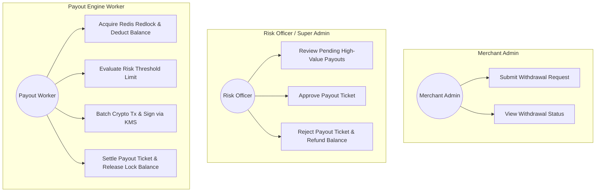
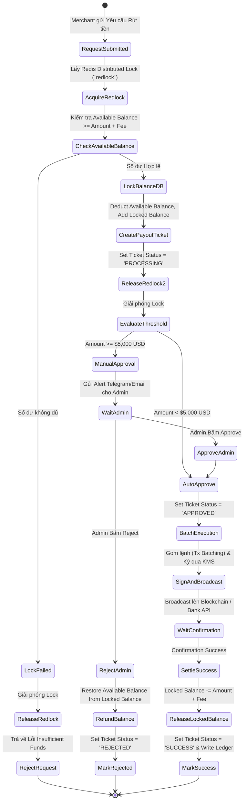
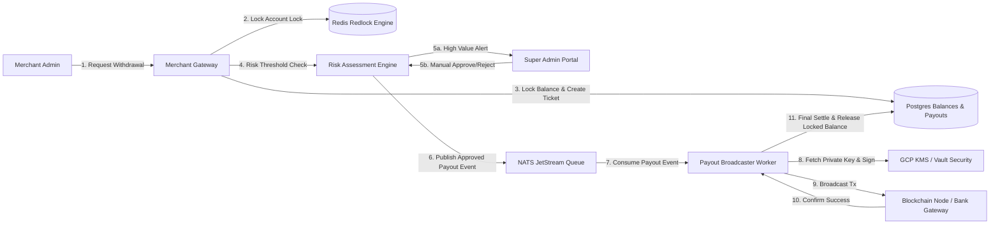
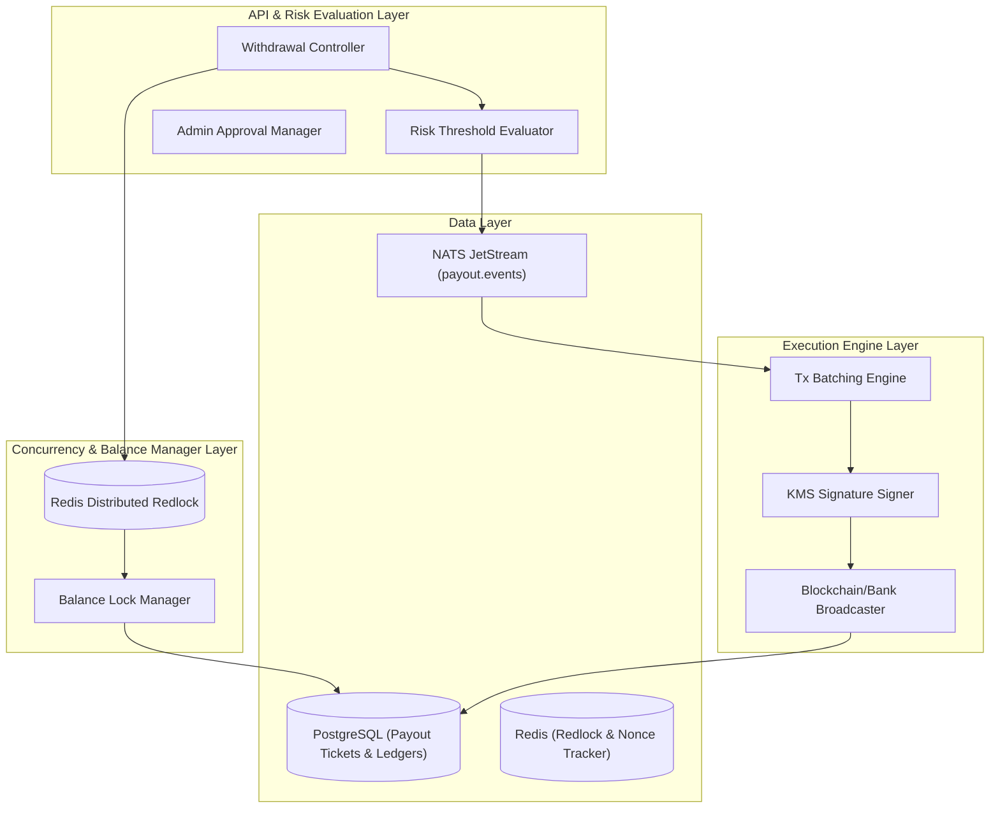
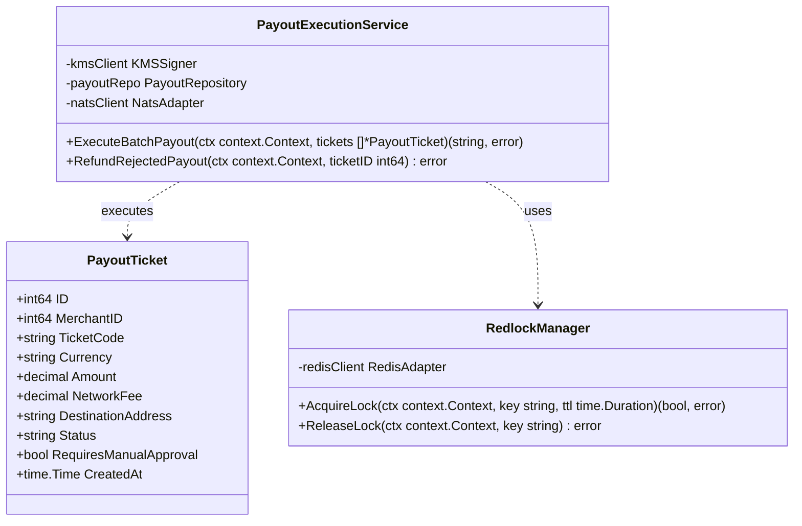
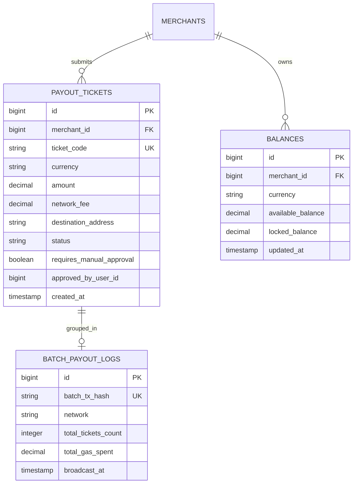

# 📄 Nghiệp vụ 3: Yêu Cầu Rút Tiền, Khóa Số Dư & Duyệt Hạn Mức An Toàn (Automatic Withdrawal & Risk Threshold Payout)

Tài liệu này tả chi tiết quy trình nghiệp vụ, sơ đồ Use Case, Activity, DFD, Component, Class/Struct và ERD cho phân hệ **Chi trả / Rút tiền (Payout/Withdrawal Engine), Khóa số dư khả dụng chống Race-Condition và Duyệt hạn mức an toàn tự động/thủ công (Risk Threshold Approval)**.

---

## 📑 1. Quy Trình Nghiệp Vụ Chi Tiết (Business Workflow)

1. **Khởi tạo Yêu cầu Rút tiền (Withdrawal Request)**:
   - Merchant Admin gọi API `/v1.PaymentService/RequestWithdrawal` kèm `Amount`, `Currency`, `DestinationAddress/BankNo` và `Idempotency-Key`.
   - Gateway xác thực HMAC Signature và kiểm tra quyền `Withdraw` của API Key.
2. **Chống Race-Condition & Khóa Số dư Khả dụng (Balance Locking)**:
   - Worker mở **Redis Distributed Lock (`redlock`)** trên `Merchant_ID`: `lock:merchant:{id}:withdraw`.
   - Kiểm tra Số dư khả dụng (`Available Balance` >= `Amount` + `Fee`).
   - Mở PostgreSQL Transaction:
     - `Available Balance` = `Available Balance` - (`Amount` + `Fee`).
     - `Locked Balance` = `Locked Balance` + `Amount` + `Fee`.
     - Khởi tạo Lệnh Rút tiền (`Withdrawal Ticket`) ở trạng thái `PROCESSING`.
   - Mở Redis Distributed Lock.
3. **Phân Luồng Kiểm Soát Rủi Ro (Risk Threshold Approval Evaluation)**:
   - System kiểm tra số tiền rút so với Hạn mức An toàn (`Risk Threshold`, VD: $5,000 USD):
     - **Nếu Amount < $5,000**: Tự động duyệt ➔ Chuyển trạng thái sang `APPROVED_AUTO` và đẩy Event `payout.execute` vào **NATS JetStream Queue**.
     - **Nếu Amount >= $5,000**: Tự động giữ ➔ Chuyển trạng thái sang `PENDING_ADMIN_APPROVAL`. Gửi cảnh báo Telegram/Email cho Super Admin Risk Officer.
4. **Super Admin Duyệt / Từ chối (Manual Review Flow)**:
   - **Trường hợp Approve**: Admin bấm "Approve" trên Admin Portal ➔ Chuyển trạng thái sang `APPROVED_MANUAL` ➔ Đẩy Event `payout.execute` vào NATS.
   - **Trường hợp Reject**: Admin bấm "Reject" kèm lý do ➔ Chuyển trạng thái sang `REJECTED` ➔ **Hoàn tiền số dư**: `Locked Balance` trừ đi, `Available Balance` cộng lại nguyên vẹn.
5. **Thực thi Chuyển tiền & Tối ưu Phí Gas (On-chain / Banking Execution)**:
   - Worker nhận Event `payout.execute` từ NATS.
   - **Crypto Transaction Batching**: Gom nhiều lệnh rút nhỏ cùng mạng (VD: TRON/BSC) thành 1 giao dịch Multi-output để tiết kiệm 60% Phí Gas.
   - Ký giao dịch bằng Private Key từ KMS/Vault và phát sóng (Broadcast) lên Blockchain / Banking API.
6. **Xác nhận Hoàn tất & Ghi Sổ cái (Settlement & Webhook)**:
   - Khi On-chain Tx đạt đủ số Block Confirmation / Ngân hàng báo chuyển thành công:
     - `Locked Balance` trừ đi lượng tiền đã rút.
     - Chuyển trạng thái Ticket sang `SUCCESS`.
     - Ghi dòng Ledger Entry cho khoản phí dịch vụ và khoản tiền đã chi.
     - Gửi Webhook báo về cho Merchant.

---

## 🎯 2. Sơ Đồ Use Case (Use Case Diagram)

---

## 🔄 3. Sơ Đồ Hoạt Động (Activity Diagram)

---

## 🌊 4. Sơ Đồ Luồng Dữ Liệu (Data Flow Diagram - DFD Level 1)

---

## 🧩 5. Sơ Đồ Thành Phần (Component Diagram)

---

## 📐 6. Sơ Đồ Lớp / Struct Go (Class / Struct Diagram)

---

## 🗄️ 7. Sơ Đồ Thực Thể Liên Kết (ERD - Entity Relationship Diagram)

