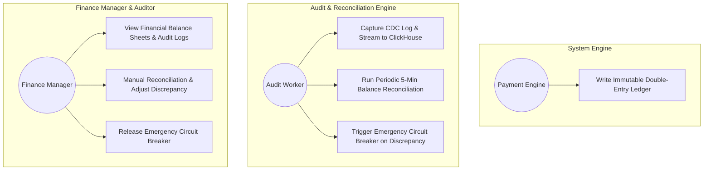
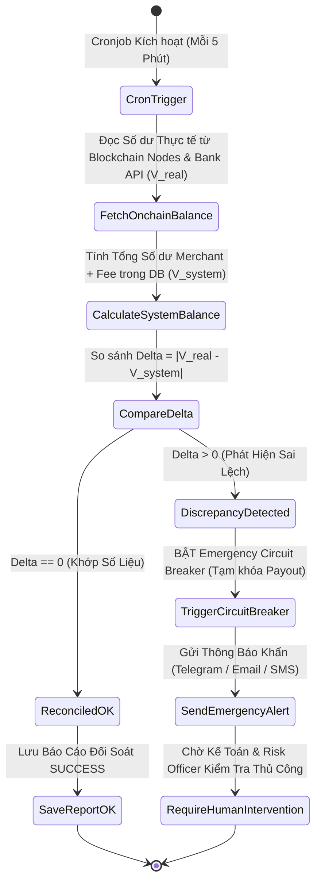
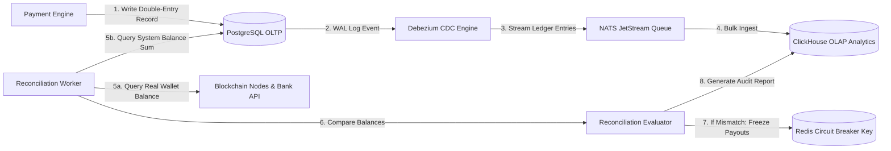
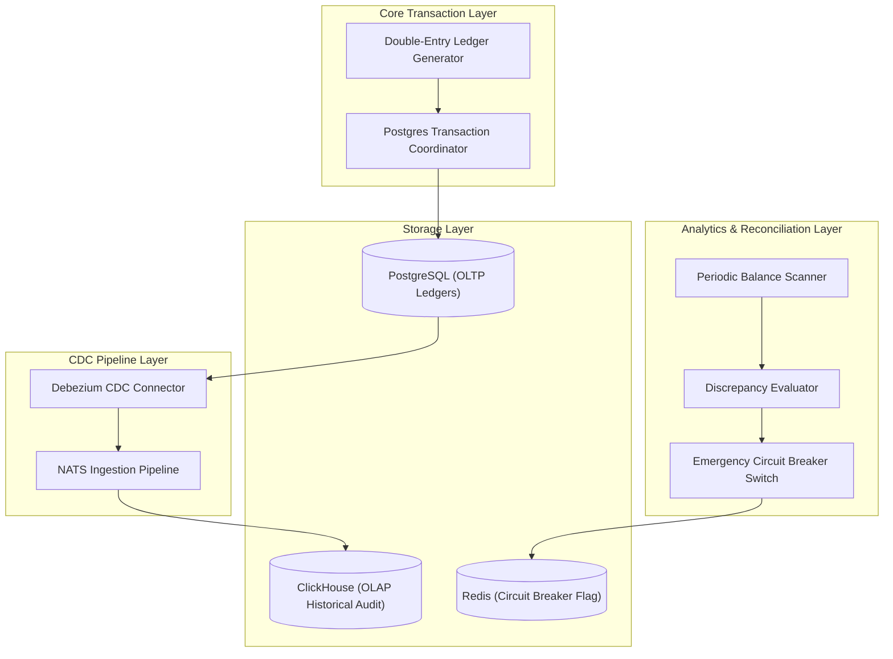
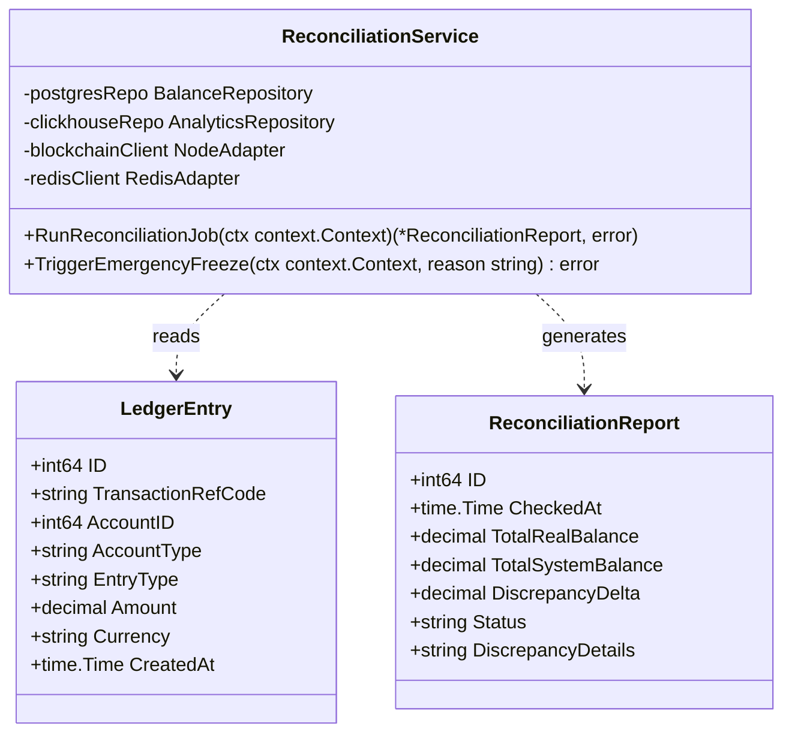
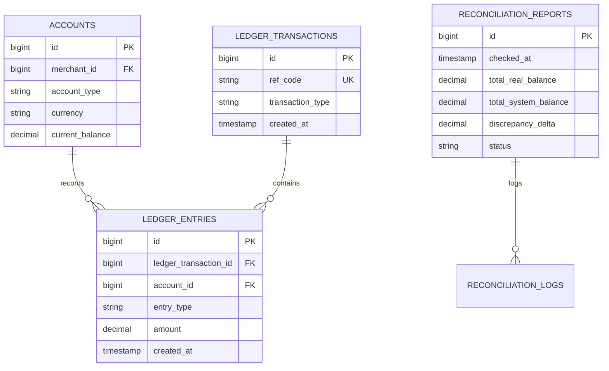

# 📄 Nghiệp vụ 4: Sổ Cái Ghi Đúp & Tự Động Đối Soát Tài Chính (Double-Entry Ledger & Financial Reconciliation Engine)

Tài liệu này mô tả chi tiết quy trình nghiệp vụ, sơ đồ Use Case, Activity, DFD, Component, Class/Struct và ERD cho phân hệ **Ghi sổ đúp (Double-Entry Ledger), Lưu vết biến động tài chính bất biến và Tự động đối soát tài chính (Automated Financial Reconciliation)**.

---

## 📑 1. Quy Trình Nghiệp Vụ Chi Tiết (Business Workflow)

1. **Nguyên tắc Ghi Sổ Đúp Bất Biến (Immutable Accounting Double-Entry)**:
   - Hệ thống **TUYỆT ĐỐI KHÔNG** sử dụng câu lệnh `UPDATE balance SET amount = ...` trực tiếp mà không kèm theo dòng ghi log sổ cái.
   - Mọi biến động tiền tệ (Nạp tiền, Rút tiền, Phí dịch vụ, Thưởng, Hoàn tiền) phải được ghi nhận dưới dạng một cặp giao dịch **Nợ (Debit)** và **Có (Credit)**:
     $$\sum \text{Debit Amount} \quad \equiv \quad \sum \text{Credit Amount}$$
2. **Luồng Ghi nhận Sổ cái (Ledger Writing Workflow)**:
   - Khi có bất kỳ giao dịch Nạp/Rút thành công, `payment-engine` tự động sinh ra một `Ledger Transaction Entry` bao gồm 2 hoặc nhiều dòng `ledger_entries`:
     - *Ví dụ Luồng Nạp 100 USDT (Phí 1%)*:
       - `Debit` Tài khoản Tiền Nguồn Hệ thống (System Clearing Account): +100 USDT.
       - `Credit` Tài khoản Ví Khả Dụng Merchant (Merchant Available Account): +99 USDT.
       - `Credit` Tài khoản Doanh Thu Phí Hệ thống (Platform Revenue Account): +1 USDT.
3. **Đồng bộ Dữ liệu Kiểm toán quy mô lớn (CDC Pipeline to ClickHouse)**:
   - Toàn bộ các dòng `ledger_entries` mới ghi vào PostgreSQL sẽ được **Debezium CDC (Change Data Capture)** tự động bắt từ Postgres Write-Ahead Log (WAL) và stream sang **ClickHouse / BigQuery (OLAP Database)**.
   - Giúp việc lưu trữ hàng trăm triệu dòng sổ cái không làm chậm DB giao dịch chính (OLTP Postgres).
4. **Quy trình Tự động Đối soát Tài chính (Automated Reconciliation Engine)**:
   - Microservice `audit-ledger` tự động kích hoạt Cronjob chạy **5 phút/lần**:
     - **Bước 1**: Tính tổng số tiền thực tế đang lưu trữ trên tất cả các Ví On-chain & Tài khoản Ngân hàng tổng ($V_{\text{real}}$).
     - **Bước 2**: Tính tổng số dư của tất cả Merchant + Số dư Phí hệ thống ghi nhận trong Database ($V_{\text{system}}$).
     - **Bước 3**: So sánh sai lệch $\Delta = |V_{\text{real}} - V_{\text{system}}|$.
   - **Xử lý Sai lệch (Discrepancy Handling)**:
     - Nếu $\Delta = 0$: Hệ thống an toàn (Status `RECONCILED_MATCH`).
     - Nếu $\Delta > 0$ (Sai lệch dù chỉ $0.01):
       - Chuyển trạng thái hệ thống sang `RECONCILED_MISMATCH` (Alert Cấp độ Đỏ).
       - Tự động kích hoạt công tắc khẩn cấp (Emergency Circuit Breaker): **Tạm dừng tính năng Rút tiền tự động**.
       - Gửi Cảnh báo khẩn cấp Telegram/Email cho Chủ doanh nghiệp & Trưởng phòng Kế toán.

---

## 🎯 2. Sơ Đồ Use Case (Use Case Diagram)

---

## 🔄 3. Sơ Đồ Hoạt Động (Activity Diagram)

---

## 🌊 4. Sơ Đồ Luồng Dữ Liệu (Data Flow Diagram - DFD Level 1)

---

## 🧩 5. Sơ Đồ Thành Phần (Component Diagram)

---

## 📐 6. Sơ Đồ Lớp / Struct Go (Class / Struct Diagram)

---

## 🗄️ 7. Sơ Đồ Thực Thể Liên Kết (ERD - Entity Relationship Diagram)

