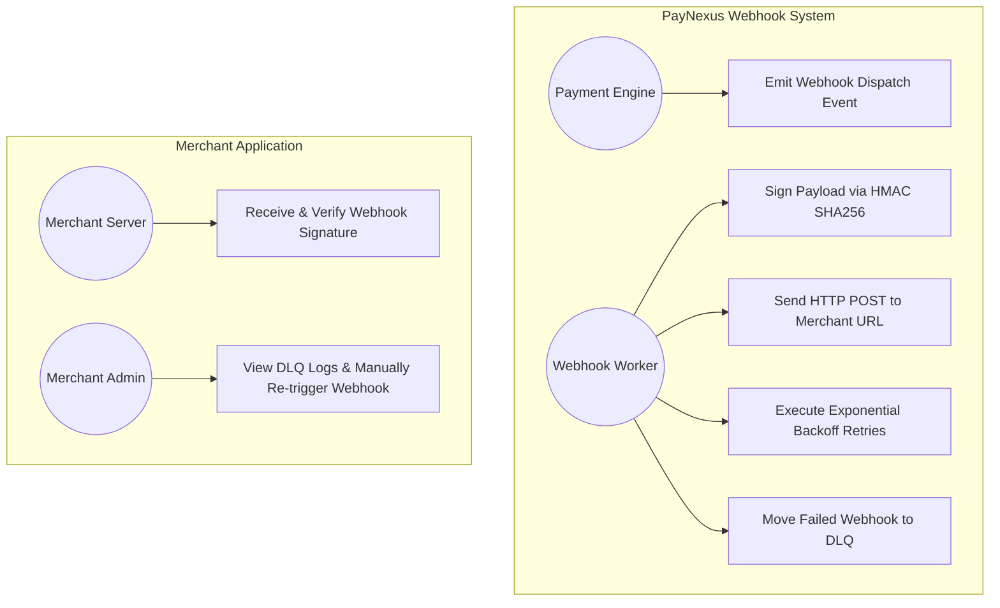
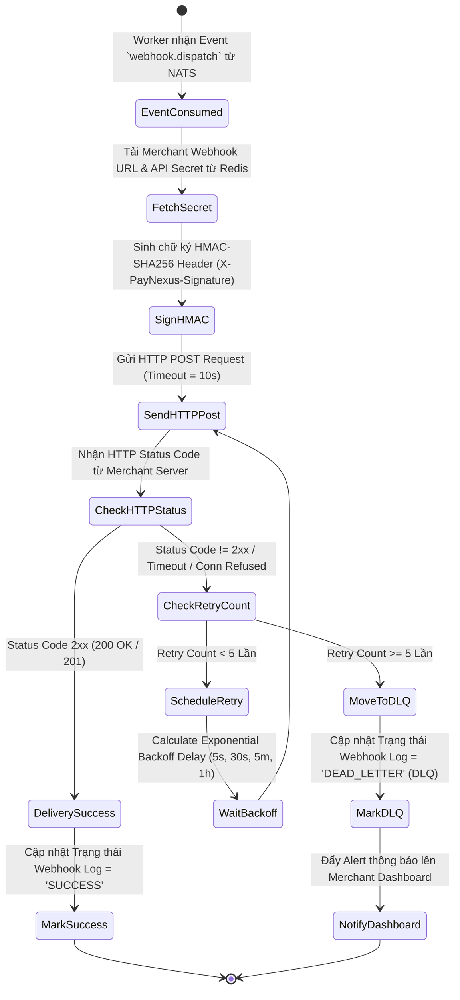
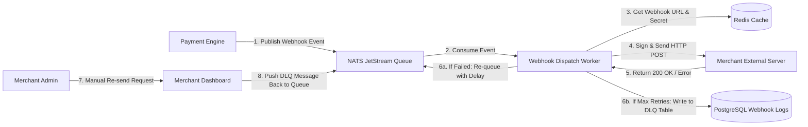
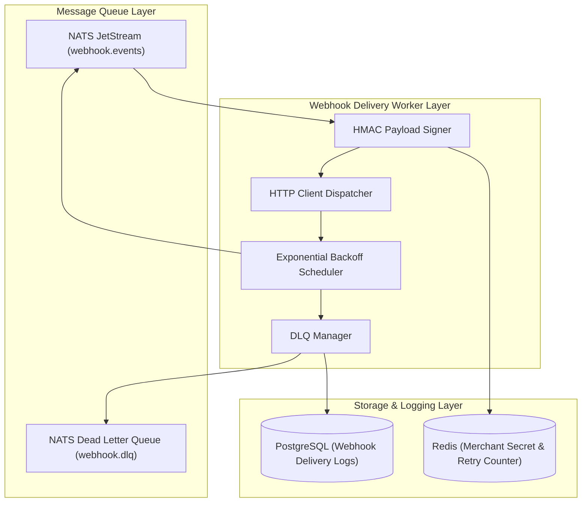
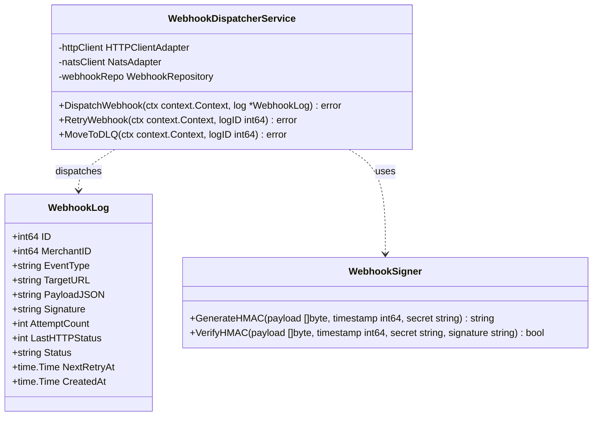
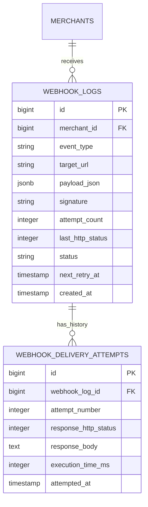

# 📄 Nghiệp vụ 5: Engine Gửi Webhook Bất Đồng Bộ Tin Cậy (Async Reliable Webhook Delivery Engine)

Tài liệu này mô tả chi tiết quy trình nghiệp vụ, sơ đồ Use Case, Activity, DFD, Component, Class/Struct và ERD cho phân hệ **Gửi Webhook thông báo bất đồng bộ tin cậy (At-Least-Once Delivery Webhook Engine), Tự động Retry lũy thừa (Exponential Backoff), Hàng chờ tin nhắn hỏng (Dead Letter Queue - DLQ) và Ký chữ ký bảo mật HMAC-SHA256**.

---

## 📑 1. Quy Trình Nghiệp Vụ Chi Tiết (Business Workflow)

1. **Phát Sự Kiện Cần Gửi Webhook (Event Triggering)**:
   - Khi bất kỳ hóa đơn Nạp (`deposit.settled`) hoặc lệnh Rút (`payout.settled`) được xử lý xong, `payment-engine` phát Event `webhook.dispatch` vào **NATS JetStream Queue**.
   - Event chứa: `MerchantID`, `EventType`, `PayloadData`, `Timestamp`.
2. **Ký Chữ Ký Bảo Mật Webhook (HMAC-SHA256 Payload Signing)**:
   - Worker nhận Event từ NATS Queue.
   - Tải `WebhookURL` và `API_SECRET` của Merchant từ Redis Cache.
   - Sinh chữ ký HMAC-SHA256 bảo mật:
     ```
     Signature = HMAC-SHA256(Timestamp + "." + PayloadJSON, API_SECRET)
     ```
   - Thêm Header bảo mật vào Request HTTP Post:
     - `X-PayNexus-Signature: t=Timestamp,v1=Signature`
     - `Content-Type: application/json`
3. **Thực thi Gửi Webhook & Kiểm tra Phản hồi (Delivery Execution)**:
   - Gửi HTTP POST Request tới `WebhookURL` của Merchant (Timeout limit = 10 giây).
   - **Xác nhận Thành công**: Nếu HTTP Status Code nhận về là `200 OK` hoặc `201 Created` ➔ Đánh dấu Gửi Webhook thành công (`SUCCESS`). Ghi log thời gian phản hồi.
4. **Chiến lược Retry Tự Động Lũy Thừa (Exponential Backoff Retries)**:
   - Nếu HTTP Status Code `!= 2xx` (VD: `500 Server Error`, `503 Service Unavailable`, `Timeout`):
     - Hệ thống đưa tin nhắn vào hàng chờ Retry với lịch trình tăng dần thời gian giãn cách:
       - **Lần 1**: Ngay lập tức.
       - **Lần 2**: Sau 5 giây.
       - **Lần 3**: Sau 30 giây.
       - **Lần 4**: Sau 5 phút.
       - **Lần 5**: Sau 1 giờ.
5. **Chuyển sang Hàng Chờ Tin Nhắn Hỏng (Dead Letter Queue - DLQ Management)**:
   - Sau **5 lần Retry thất bại** (Merchant Server bị sập kéo dài hoặc URL bị lỗi):
     - Chuyển Webhook Message vào trạng thái `DEAD_LETTER` (DLQ).
     - Gửi cảnh báo trên Merchant Dashboard: *"Cảnh báo: Server của bạn không phản hồi Webhook 5 lần liên tiếp"*.
   - **Manual Re-triggering**: Merchant Admin sau khi sửa xong server có thể vào Dashboard nhấn nút **"Re-send Webhook"** để kích hoạt gửi lại thủ công.

---

## 🎯 2. Sơ Đồ Use Case (Use Case Diagram)



---

## 🔄 3. Sơ Đồ Hoạt Động (Activity Diagram)



---

## 🌊 4. Sơ Đồ Luồng Dữ Liệu (Data Flow Diagram - DFD Level 1)



---

## 🧩 5. Sơ Đồ Thành Phần (Component Diagram)



---

## 📐 6. Sơ Đồ Lớp / Struct Go (Class / Struct Diagram)



---

## 🗄️ 7. Sơ Đồ Thực Thể Liên Kết (ERD - Entity Relationship Diagram)


