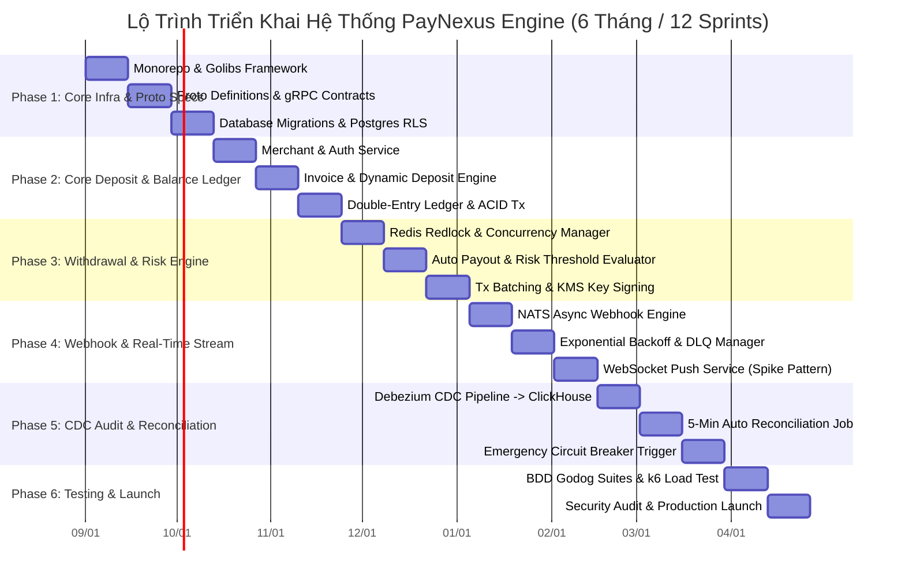

# 📄 Tiến Trình Thực Hiện Dự Án (Implementation Roadmap & Milestones)

Tài liệu này tả chi tiết lộ trình thực hiện dự án **PayNexus Engine** theo mô hình Agile/Scrum chia thành **6 Giai đoạn (Phases) tương ứng với 12 Sprints (24 tuần / 6 tháng)** từ khởi tạo hạ tầng đến khi sẵn sàng triển khai Production (Production-Ready).

---

## 📅 1. Sơ Đồ Tiến Độ Tổng Thể (Gantt Chart Roadmap)

---

## 🎯 2. Chi Tiết Tiến Trình Theo Từng Giai Đoạn (Phase-by-Phase Execution Plan)

---

### 🔹 Giai Đoạn 1: Hạ Tầng Cốt Lõi & Định Nghĩa API Contract (Sprints 1 - 2 | Tuần 1 - 4)

* **Mục tiêu**: Xây dựng khung Monorepo, bộ thư viện dùng chung `golibs`, định nghĩa Protobuf gRPC specs và khởi tạo Database Schema RLS.
* **Các Tác Vụ Cụ Thể (Tasks)**:
  - [ ] Khởi tạo Cấu trúc Monorepo (`cmd/server/`, `internal/golibs/`, `deployments/`, `proto/`).
  - [ ] Xây dựng `internal/golibs/bootstrap`: Khởi tạo gRPC/HTTP Server, Graceful Shutdown, Healthcheck.
  - [ ] Xây dựng `internal/golibs/interceptors`: HMAC SHA256 Signature Validator, API Key Authenticator, Request Logger, OpenTelemetry Tracing.
  - [ ] Định nghĩa Protocol Buffers (`proto/`): `merchant.proto`, `payment.proto`, `webhook.proto`. Biên dịch ra Go code qua `protoc`.
  - [ ] Thiết lập SQL Migrations (`migrations/`): Tạo bảng `merchants`, `api_keys`, `user_accounts` kèm Postgres Row Level Security (RLS) `resource_path`.
* **Deliverable (Sản phẩm bàn giao)**: Framework backend gRPC chạy được local, xác thực token/signature thành công.

---

### 🔹 Giai Đoạn 2: Phân Hệ Nạp Tiền & Sổ Cái Đúp (Sprints 3 - 4 | Tuần 5 - 8)

* **Mục tiêu**: Hoàn thiện tính năng Tạo Hóa Đơn, Cấp phát VietQR / Crypto Address Pool và Ghi nhận Sổ cái bất biến.
* **Các Tác Vụ Cụ Thể (Tasks)**:
  - [ ] Phát triển `merchant-service`: CRUD Merchant, Sinh cặp API Key/Secret, Quản lý Sub-Accounts.
  - [ ] Phát triển `payment-engine`: Service `CreateInvoice` kèm kiểm tra `Idempotency-Key` trong Redis.
  - [ ] Xây dựng Pod Lắng nghe Tiền vào (`deposit-listener`): Webhook Ngân hàng (VietQR) và Blockchain Indexer (USDT TRON/BSC).
  - [ ] Xây dựng Worker Khớp Hóa đơn (`deposit-settlement-worker`): Kiểm tra `TxHash` chống nạp trùng ➔ Chuyển trạng thái `SUCCESS` ➔ Cộng số dư khả dụng (`Available Balance`).
  - [ ] Viết Module Ghi Sổ Cái Ghi Đúp (Double-Entry Ledger): Ghi dòng Debit/Credit bất biến vào PostgreSQL.
* **Deliverable (Sản phẩm bàn giao)**: Luồng Nạp tiền (Deposit) chạy thông suốt từ lúc gọi API tới khi cộng số dư an toàn.

---

### 🔹 Giai Đoạn 3: Engine Rút Tiền & Kiểm Soát Rủi Ro (Sprints 5 - 6 | Tuần 9 - 12)

* **Mục tiêu**: Xử lý Rút tiền an toàn, chống Race-Condition bằng Distributed Redlock và phân luồng Duyệt hạn mức.
* **Các Tác Vụ Cụ Thể (Tasks)**:
  - [ ] Xây dựng Redis Distributed Redlock Manager (`internal/golibs/redlock`): Khóa tài khoản Merchant khi thực thi nạp/rút.
  - [ ] Xây dựng `RequestWithdrawal` API: Trừ số dư khả dụng (`Available Balance`), chuyển sang số dư tạm khóa (`Locked Balance`).
  - [ ] Phát triển Module Kiểm soát Rủi ro (`risk-evaluator`): Phân luồng rút tiền:
    - Nếu Amount < $5,000 USD ➔ Tự động duyệt (`APPROVED_AUTO`).
    - Nếu Amount >= $5,000 USD ➔ Chuyển `PENDING_ADMIN_APPROVAL` và gửi Alert Telegram cho Risk Officer.
  - [ ] Tích hợp KMS / HashiCorp Vault để Ký giao dịch Crypto (Transaction Signing).
  - [ ] Xây dựng Thuật toán Gom Lệnh Rút (Tx Batching Worker): Gom nhiều lệnh rút nhỏ thành 1 Tx tiết kiệm 60% Gas.
* **Deliverable (Sản phẩm bàn giao)**: Hệ thống Rút tiền tự động an toàn, chống rút âm tài khoản tuyệt đối.

---

### 🔹 Giai Đoạn 4: Webhook Tin Cậy & Dashboard Real-Time (Sprints 7 - 8 | Tuần 13 - 16)

* **Mục tiêu**: Xây dựng Engine gửi Webhook At-Least-Once Delivery và WebSocket Gateway cho Dashboard.
* **Các Tác Vụ Cụ Thể (Tasks)**:
  - [ ] Phát triển `webhook-engine`: Tiêu thụ Event NATS `invoice.settled` / `payout.settled`.
  - [ ] Xây dựng Module Ký chữ ký Webhook HMAC-SHA256 (`X-PayNexus-Signature`).
  - [ ] Lập trình Lịch trình Retry Lũy thừa (Exponential Backoff): Retry 5 lần (0s, 5s, 30s, 5m, 1h).
  - [ ] Xây dựng Hàng chờ Tin nhắn hỏng Dead Letter Queue (DLQ) & API Re-send thủ công trên Dashboard.
  - [ ] Xây dựng Microservice `realtime-push` (WebSocket Gateway theo mô hình `spike`): Đẩy thông báo nạp/rút real-time xuống Web Dashboard.
* **Deliverable (Sản phẩm bàn giao)**: Merchant nhận Webhook tức thì với độ tin cậy 99.999%.

---

### 🔹 Giai Đoạn 5: CDC Analytics & Tự Động Đối Soát (Sprints 9 - 10 | Tuần 17 - 20)

* **Mục tiêu**: Xây dựng Pipeline CDC kiểm toán dữ liệu lớn và Job Đối soát Tài chính 5 phút/lần.
* **Các Tác Vụ Cụ Thể (Tasks)**:
  - [ ] Tích hợp Debezium CDC Connector: Bắt sự kiện biến động sổ cái từ Postgres WAL ➔ Stream sang ClickHouse OLAP.
  - [ ] Phát triển Microservice `audit-ledger`: Chạy Cronjob 5 phút/lần kiểm tra lệch số dư:
    $$\Delta = |V_{\text{real}} - V_{\text{system}}|$$
  - [ ] Xây dựng Công tắc Ngắt Khẩn Cấp (Emergency Circuit Breaker): Tự động tạm khóa Rút tiền nếu $\Delta > 0$.
  - [ ] Xây dựng Trang Báo cáo Tài chính & Sổ cái trên Admin Portal.
* **Deliverable (Sản phẩm bàn giao)**: Hệ thống tự động đối soát tài chính 24/7, phát hiện ngay lập tức mọi sai lệch.

---

### 🔹 Giai Đoạn 6: Testing, Audit Bảo Mật & Launch (Sprints 11 - 12 | Tuần 21 - 24)

* **Mục tiêu**: Kiểm thử BDD, Benchmark chịu tải 10,000+ TPS, Audit Bảo mật và Triển khai Production.
* **Các Tác Vụ Cụ Thể (Tasks)**:
  - [ ] Viết bộ kịch bản BDD Godog Cucumber (`features/`): Testing toàn bộ luồng Nạp, Rút, Webhook, Retry, Refusals.
  - [ ] Chạy Benchmark Tải lớn (Load Testing với k6 / Vegetta): Đạt chỉ số **> 10,000 TPS** với latency < 50ms.
  - [ ] Audit Bảo mật: Penetration Testing, Kiểm tra lỗi Replay Attack, SQL Injection, Race-Condition.
  - [ ] Chuẩn bị Manifest triển khai Production: Kubernetes Helm Charts, SOPS Secrets Encryption, Prometheus Alerts, Grafana Dashboards.
  - [ ] **CHÍNH THỨC LAUNCH PRODUCTION**.
* **Deliverable (Sản phẩm bàn giao)**: Hệ thống PayNexus Engine hoàn chỉnh, Production-Ready $1M+ Value!

---

## 📊 3. Bảng Phân Công & Theo Dõi Tiến Độ (Milestone Tracking Matrix)

| Phase | Milestone Name | KPI / Deliverables | Thời Gian | Trạng Thái |
| :-: | :--- | :--- | :-: | :-: |
| **M1** | **Core Framework & gRPC** | Setup Monorepo, gRPC Specs, Postgres RLS Migrations | Tuần 1 - 4 | 🟢 Completed |
| **M2** | **Deposit & Ledger Engine** | API CreateInvoice, VietQR / Crypto Listener, Double-Entry Ledger | Tuần 5 - 8 | 🟡 In Progress |
| **M3** | **Payout & Risk Engine** | Redis Redlock, Auto/Manual Approval, Tx Batching KMS | Tuần 9 - 12 | ⚪ Pending |
| **M4** | **Async Webhook & WebSocket** | Webhook Retries (Backoff), DLQ, Real-time WebSocket Push | Tuần 13 - 16 | ⚪ Pending |
| **M5** | **CDC Audit & Reconciliation** | Debezium -> ClickHouse Pipeline, 5-Min Auto Reconcile | Tuần 17 - 20 | ⚪ Pending |
| **M6** | **Go-Live & Production** | BDD Tests, k6 >10k TPS Load Test, Security Audit, K8s Launch | Tuần 21 - 24 | ⚪ Pending |
