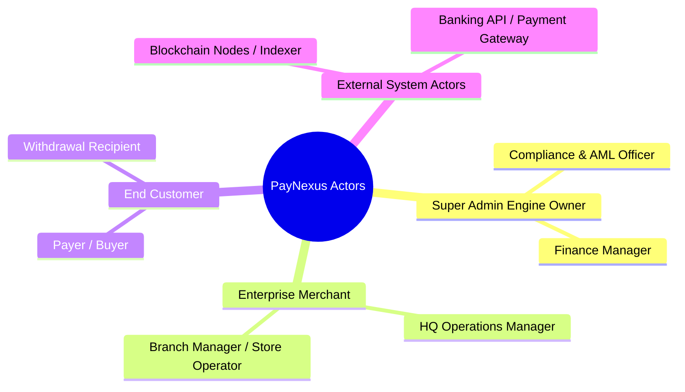

Viewed gserver.go:9-40
Edited untitled:Untitled-1

# 📘 ĐẶC TẢ SẢN PHẨM ENTERPRISE: PAYNEXUS ENGINE

### **Hệ Thống Hạ Tầng Chuyển Mạch Thanh Toán & Xử Lý Nạp/Rút Tự Động (Hybrid Fiat & Multi-Chain Crypto)**

---

## 🏛️ I. BỐI CẢNH THỊ TRƯỜNG & GIÁ TRỊ DOANH NGHIỆP ($1M+ VALUE)

### 1. Vấn đề thực tế của thị trường (Pain Points)

Các doanh nghiệp toàn cầu (E-Commerce, iGaming, Web3 Gaming, SaaS, B2B Cross-border) khi triển khai cổng thanh toán nạp/rút tiền đối mặt với 4 rào cản lớn:

- **Tắc nghẽn & Nghẽn đối soát (Reconciliation Bottleneck)**: Khi số lượng đơn hàng đạt 100.000+ giao dịch/ngày, việc kế toán đối soát thủ công giữa tiền vào ngân hàng/ví crypto với đơn hàng gây thất thoát hàng triệu USD mỗi năm.
- **Rủi ro Nạp/Rút Trùng (Double-Spending / Double-Deposit)**: Mạng lag, Webhook retry không an toàn hoặc nghẽn mạng làm doanh nghiệp bị cộng tiền 2 lần cho khách hàng.
- **Tốn kém chi phí giao dịch (High Tx Fees)**: Thiếu thuật toán gom lệnh (Tx Batching) và tự động tối ưu Gas Fee khi rút tiền Crypto.
- **Phân mảnh kênh thanh toán**: Doanh nghiệp phải duy trì hàng chục kết nối riêng lẻ với Ngân hàng (NAPAS, Swift) và nhiều chuỗi Blockchain (Tron, BSC, Ethereum, Solana).

### 2. Giải pháp của PayNexus Engine

PayNexus đóng vai trò là một **Middleware Chuyển mạch Tài chính (Payment Switch Engine)** đứng giữa Doanh nghiệp (Merchants) và các Kênh thanh toán (Ngân hàng & Blockchain Nodes).

Hệ thống cung cấp **DUY NHẤT 1 API chuẩn hóa**, tự động hóa toàn bộ luồng Nạp -> Chuyển đổi -> Rút -> Đối soát sổ cái real-time với độ tin cậy tuyệt đối (Zero Data Loss).

---

## 👥 II. CÁC TÁC NHÂN TRONG HỆ THỐNG (SYSTEM ACTORS & USER PERSONAS)



### 1. Super Admin (Chủ sở hữu Hạ tầng PayNexus)

- **Vài trò**: Quản trị toàn bộ nền tảng, theo dõi Tổng số dư trên các Ví Hot/Cold Wallet, cài đặt phí dịch vụ (Platform Fee).
- **Nhiệm vụ**: Chống rửa tiền (AML), duyệt các lệnh rút tiền vượt hạn mức an toàn (Threshold Approval), quản lý Cluster Health.

### 2. Enterprise Merchant (Doanh nghiệp Tích hợp)

- **Vai trò**: Các công ty/cửa hàng sử dụng cổng PayNexus để thu tiền hoặc chi trả cho khách hàng.
- **Nhiệm vụ**: Tạo API Key / Secret, đăng ký Webhook Endpoint URL, theo dõi số dư khả dụng (`Available Balance`), yêu cầu rút tiền về tài khoản ngân hàng/ví riêng.

### 3. Merchant Sub-Account / Branch Staff (Nhân viên Chi nhánh / Cửa hàng)

- **Vai trò**: Nhân viên thuộc doanh nghiệp Merchant được cấp quyền hạn hẹp.
- **Nhiệm vụ**: Được xem lịch sử giao dịch tại chi nhánh mình quản lý, tạo mã QR nạp tiền cho khách hàng tại điểm bán (POS), **KHÔNG có quyền** rút tiền hay xem Secret Key của doanh nghiệp.

### 4. End Customer (Người dùng cuối)

- **Vai trò**: Khách hàng mua hàng hoặc nạp/rút tiền trên hệ thống của Merchant.
- **Nhiệm vụ**: Thao tác quét mã QR Chuyển khoản Ngân hàng hoặc chuyển Crypto (USDT/USDC) vào địa chỉ Ví được chỉ định.

### 5. External System Actors (Tác nhân Hệ thống Bên ngoài)

- **Blockchain Indexer Listener**: Hệ thống lắng nghe sự kiện On-chain (Solana, TRON, BSC, Ethereum).
- **Core Banking / Payment Provider API**: Cổng kết nối Ngân hàng (VietQR, NAPAS, Swift, Staking Gateways).

---

## ⚙️ III. ĐẶC TẢ CHI TIẾT CÁC PHÂN HỆ CHỨC NĂNG (FUNCTIONAL SPECIFICATIONS)

---

### 🟢 PHÂN HỆ 1: QUẢN LÝ ĐA THUÊ BAO & TÀI KHOẢN (MULTI-TENANT & RBAC)

Hệ thống phục vụ hàng ngàn Merchant trên cùng một hạ tầng chung thông qua **Postgres Row Level Security (RLS)**.

- **Merchant Onboarding & API Keys**:
  - Tự động sinh cặp khóa: `API_KEY_PUBLIC` (cho Client-side) và `API_SECRET_PRIVATE` (chỉ dùng Server-to-Server HMAC SHA256).
  - Cho phép thiết lập danh sách IP Whitelist được phép gọi API.
- **Phân quyền truy cập theo vị trí / chi nhánh (Location-Restricted RBAC)**:
  - Nhân viên chi nhánh A chỉ truy cập được dữ liệu hóa đơn sinh ra tại chi nhánh A (`resource_path = /org1/branchA/`).

---

### 🔵 PHÂN HỆ 2: CỔNG NẠP TIỀN & XỬ LÝ HÓA ĐƠN (DEPOSIT & INVOICE GATEWAY)

- **Sinh Hóa Đơn & Quản lý Pool Địa chỉ Ví (Address Pool Management)**:
  - Khi Merchant gọi `CreateInvoice(Amount, Currency)`:
    - **Với Fiat**: Sinh mã **VietQR** chuẩn kèm `Memo Code` độc nhất (VD: `NEXUS88992`).
    - **Với Crypto**: Cấp phát 1 địa chỉ ví tạm thời từ Pool Ví hoặc gán `Memo/Tag` cố định cho từng hóa đơn.
- **Xử lý Bất đồng bộ & Chống Nạp Trùng (Idempotent Deposit Ingestion)**:
  - Khi có tiền vào Ngân hàng/Blockchain, Event gửi về NATS Queue.
  - **Idempotent Processor**: Kiểm tra `TxHash` (Crypto) hoặc `TransactionID` (Ngân hàng) trong Redis. Nếu đã xử lý ➔ Bỏ qua ngay lập tức.
  - Nếu chưa xử lý ➔ Mở **Postgres ACID Transaction Lock**, cập nhật trạng thái Invoice sang `PAID`, cộng số dư Merchant và ghi Log Sổ cái.

---

### 🔴 PHÂN HỆ 3: ENGINE RÚT TIỀN TỰ ĐỘNG & BẢO VỆ DÒNG TIỀN (AUTO PAYOUT ENGINE)

- **Xử lý Lệnh Rút Tiền (Withdrawal Flow)**:
  1. Merchant gọi `RequestWithdrawal(Amount, Destination)`.
  2. Kiểm tra `Available Balance` trong DB.
  3. Mở **Redis Distributed Lock (`redlock`)** trên `Merchant_ID` để tránh race-condition (Ví dụ: Merchant cố tình gọi 2 lệnh rút tiền cùng 1 milisecond).
  4. Trừ số dư khả dụng ➔ Chuyển số tiền đó vào `Locked Balance`.
- **Cơ chế Hạn mức An toàn (Risk Threshold Approval)**:
  - Nếu số tiền rút `< $5,000`: Hệ thống tự động ký giao dịch (Auto-sign) và đẩy thẳng ra Blockchain/Banking Node.
  - Nếu số tiền rút `≥ $5,000`: Chuyển lệnh sang trạng thái `PENDING_ADMIN_APPROVAL` và gửi thông báo Telegram/Email cho Risk Officer.
- **Tối ưu phí Gas (Crypto Tx Batching)**:
  - Gom nhiều lệnh rút nhỏ thành 1 Giao dịch đa đầu ra (Multi-output Transaction) để tiết kiệm 60% phí Gas trên mạng Ethereum/Bitcoin.

---

### 🟡 PHÂN HỆ 4: SỔ CÁI ĐÚP & TỰ ĐỘNG ĐỐI SOÁT (DOUBLE-ENTRY LEDGER & RECONCILIATION)

Tất cả biến động tài chính đều tuân theo nguyên tắc **Accounting Double-Entry (Ghi sổ đúp)**:

```
[Mọi Giao Dịch] ➔ Debit (Nợ) Account X  <===>  Credit (Có) Account Y
```

- **Không Bao Giờ Xóa/Sửa Lịch Sử (Immutable Audit Log)**: Không có câu lệnh `UPDATE balances SET amount = ...`. Mọi biến động đều là các dòng `INSERT` vào bảng `ledger_entries`.
- **Đối soát Tự động (Automated Reconciliation Engine)**:
  - Microservice `audit-ledger` tự động quét 5 phút/lần giữa:
    $$\text{Tổng tiền thực có trên Ví/Ngân hàng} \quad \stackrel{?}{=} \quad \sum (\text{Số dư tất cả các Merchant}) + \text{Phí nền tảng}$$
  - Nếu phát hiện lệch dù chỉ $0.01 ➔ Hệ thống tự động phát cảnh báo đỏ (Critical Alert) và Tạm dừng tính năng Rút tiền tự động để bảo vệ tài sản.

---

### 🟣 PHÂN HỆ 5: ENGINE GỬI WEBHOOK TIN CẦY (ASYNC RELIABLE WEBHOOK)

Khi hóa đơn nạp/rút hoàn tất, PayNexus phải báo kết quả về cho Merchant App qua HTTP Webhook:

- **Cam kết At-Least-Once Delivery**: Gửi thành công ít nhất 1 lần.
- **Chiến lược Retry Tự động (Exponential Backoff)**:
  - Lần 1: Ngay lập tức.
  - Lần 2: Sau 5 giây.
  - Lần 3: Sau 30 giây.
  - Lần 4: Sau 5 phút.
  - Lần 5: Sau 1 giờ.
- **Dead Letter Queue (DLQ)**: Sau 5 lần retry nếu Server của Merchant vẫn bị sập ➔ Đẩy tin nhắn vào DLQ trên Dashboard để Merchant có thể bấm nút **"Re-send Webhook"** thủ công bằng tay.
- **Bảo mật Webhook**: Mọi request Webhook gửi đi đều kèm Header `X-PayNexus-Signature: t=timestamp,v1=hash` để Merchant xác minh request đúng là do PayNexus gửi.

---

## 📊 IV. YÊU CẦU PHI NGHIỆP VỤ & TẢI TRỌNG CHUẨN ENTERPRISE (NON-FUNCTIONAL REQUIREMENTS)

| Tiêu chuẩn                     | Chỉ số Yêu cầu (SLA)                       | Giải pháp Kiến trúc                                               |
| :----------------------------- | :----------------------------------------- | :---------------------------------------------------------------- |
| **Độ Sẵn Sàng (Availability)** | **99.99% Uptime** (Downtime < 52 phút/năm) | Kubernetes Multi-zone cluster, Auto-scaling Pods.                 |
| **Tốc Độ Xử Lý (Throughput)**  | **10,000+ TPS** (Transactions Per Second)  | gRPC Protobuf, Go Goroutine Pools, Redis Caching.                 |
| **Độ Trễ API (Latency)**       | **< 50ms** cho các tác vụ ghi sổ nạp/rút   | PostgreSQL Connection Pooling (`pgx`), Async Processing via NATS. |
| **Tính Toàn Vẹn Dữ Liệu**      | **Zero Data Loss (0% mất tiền)**           | PostgreSQL WAL Replication, Change Data Capture (CDC Debezium).   |
| **Bảo Mật Tiêu Chuẩn**         | **PCI-DSS Compliance & SOC2 Ready**        | Mã hóa SOPS/KMS, Audit Log bất biến trên ClickHouse.              |

---

## 🎯 V. TỔNG KẾT: TẠI SAO ĐÂY LÀ DỰ ÁN "TRIỆU ĐÔ"?

1. **Khả năng thương mại hóa ngay lập tức**: Bạn có thể đóng gói sản phẩm này và bán dạng **B2B SaaS Payment Gateway** cho các trang thương mại điện tử, game studio, sàn giao dịch nhỏ.
2. **Giải quyết bài toán quy mô lớn của Fintech**: Xử lý triệt để race-condition, double-spending, đối soát tài chính tự động và webhook tin cậy.
3. **Minh chứng cho năng lực Lead/Principal Engineer**: Cho thấy bạn không chỉ biết viết code Go/NestJS mà còn có **Tư duy Kiến trúc Hệ thống Tài chính**, am hiểu về Security, DB Performance và Scalability.
